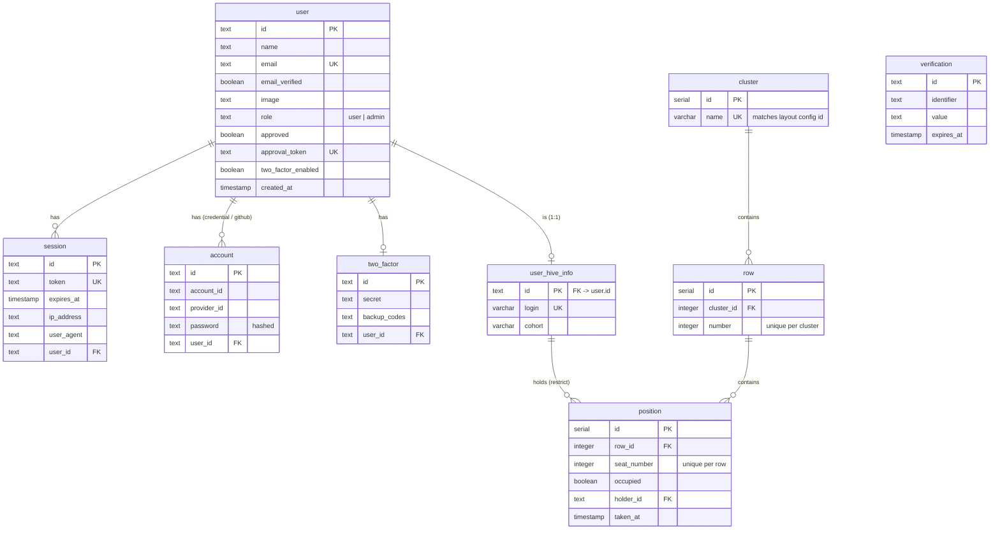

_This project has been created as part of the 42 curriculum by akuchmam, vlundaev, mklevero, vmoroka, and piyu._
# Cluster Map

## Description

**Cluster Map** is a web application that shows, in real time, which seats in the
Hive (42 network) campus clusters are free and which are taken. The map follows
each room's physical layout. Every seat is labelled with its row and place number,
and colour plus a text status show whether it is free or taken. Selecting an
occupied seat shows who is sitting there.

The goal is to help students find a free workstation quickly, from a desktop or a
phone, without walking between rooms.

### Key features

- **Interactive cluster map.** Rows, numbered places, and gaps match each room's
  real layout, loaded from a validated JSON configuration file.
- **Live occupancy.** Server-Sent Events push only the seats that changed. The UI
  recovers after database or network failures and keeps the last known map
  visible, marked as stale.
- **Peer details.** Click, tap, or use the keyboard on an occupied seat to see the
  peer's login, display name, and avatar. Hover alone is never required, and
  email addresses are never exposed on the map.
- **Accounts with administrator approval.** Users sign up with email and password
  or GitHub OAuth. An administrator must approve new accounts before they can see
  the map.
- **Two-factor authentication.** TOTP setup with a QR code or setup key, backup
  codes shown at setup, a login challenge with a "trust this device" option, and
  password-confirmed disabling.
- **Admin console.** Administrators list users, approve pending accounts, and
  delete accounts at `/admin/users`.
- **Responsive, themed UI.** A mobile layout, dark mode, and a component library
  based on Untitled UI and React Aria, adapted to the Hive brand.
- **Privacy Policy and Terms of Service.** Public pages at `/privacy` and `/terms`,
  linked from the footer and the auth screens.
- **Occupancy simulator.** An optional demo process that makes synthetic users
  take and free seats, so real-time updates can be shown during evaluation.
- **Documentation site.** A Docusaurus site covering architecture, the API,
  configuration, deployment, and operations.
- **CI/CD.** GitHub Actions runs checks on every pull request, publishes images to
  GHCR, and deploys to staging and production through Coolify. Runtime secrets
  come from Infisical.

## Team Information

> ⚠️ **TO VERIFY:** These summaries are based on commit history and the docs.
> Each member should review and expand their own entry.

| Member                 | Role(s)                                               | Responsibilities                                                                                                                                                                                                            |
| ---------------------- | ----------------------------------------------------- | --------------------------------------------------------------------------------------------------------------------------------------------------------------------------------------------------------------------------- |
| **Artem Kuchmambetov** | Tech Lead / Architect, Full-stack Developer, PO | Defines the architecture and tech stack. Reviews critical changes. Owns the monorepo setup, CI/CD, deployment, and documentation site. Built the admin, 2FA and OAuth UI flows, the legal pages, and the simulator. |
| **Maxim Kleverov**     | Frontend Developer, PM | Builds the cluster map UI: rows, seats, popups, colour system, theming, dark mode, and the mobile layout. Integrates the frontend with the API. |
| **Vitalii Lundaev**    | Backend Developer, PO | Builds the Express API: cluster endpoints, the SSE polling pool, authentication (Better Auth, GitHub OAuth, TOTP 2FA), and the API unit and integration tests. Wrote the API and DB contracts. |
| **Valentine Moroka**   | Backend / Database Developer | Sets up PostgreSQL and Drizzle. Designed the initial schema and migrations. |
| **Ping Yu**            | DevSecOps / PO | Designed the CI/CD architecture. Participated in the build of docker and security layer. Owns the project README. |

## Project Management

- **Work organisation.** Work is split by area (API, web, database, docs,
  security), and each area has a long-lived development branch: `dev-api`,
  `dev-web`, `dev-db`, and `dev-docs`. Work is merged into `staging` first,
  then into `main`. Pull requests use
  [Conventional Commits](https://www.conventionalcommits.org/) titles and are
  squash-merged.
- **Code review.** Every pull request to `staging` or `main` must pass CI
  (formatting, lint, type checks, all test suites, and builds) and be approved
  by other team members.
- **Meetings.** Bi-weekly on-site or online meetings plus ad-hoc pairing
  sessions.
- **Tools.**
  - **Trello** for the task board and backlog.
  - **GitHub** for issues, pull requests, and Actions.
  - **Docusaurus** docs site for recording decisions and documenting the project.
- **Communication.** Discord for day-to-day messages.

## Instructions

### Prerequisites

| Tool                     | Version                                                       |
| ------------------------ | ------------------------------------------------------------- |
| Node.js                  | 24 (the version used in the Dockerfiles and CI)               |
| pnpm                     | 11.5.2 (pinned in the root `package.json`)                    |
| Docker + Docker Compose  | Any recent version (runs the local PostgreSQL 17 database)    |
| OpenSSL                  | Used to generate the auth secret                              |
| GitHub OAuth App         | Optional; only needed to test GitHub sign-in                  |

### 1. Install and configure

```bash
pnpm install
cp .env.example .env
openssl rand -base64 32   # paste the output into BETTER_AUTH_SECRET
```

Minimum `.env` for local development:

```dotenv
API_PORT=5001
WEB_ORIGIN=http://localhost:5173
VITE_API_URL=http://localhost:5001
PG_USER=app
PG_DB=app
PG_PASSWORD=app
PG_HOST=localhost
PG_PORT=5432
BETTER_AUTH_SECRET=<at-least-32-characters>
BETTER_AUTH_URL=http://localhost:5001
GITHUB_CLIENT_ID=<your-client-id-or-any-non-empty-dummy>
GITHUB_CLIENT_SECRET=<your-client-secret-or-any-non-empty-dummy>
```

`GITHUB_*` values are required even for password-only login. Any non-empty value
works locally. For real GitHub sign-in, set the OAuth App callback to
`http://localhost:5001/api/auth/callback/github`. Never commit `.env`. See
[Environment Variables](apps/docs/docs/reference/environment-variables.mdx) for
the full list.

### 2. Prepare the database

```bash
pnpm db:up                         # start PostgreSQL (docker-compose.dev.yml)
pnpm --filter @repo/api... build   # build the API and shared packages
pnpm db:migrate                    # apply Drizzle migrations
pnpm db:seed                       # optional demo data (refuses NODE_ENV=production)
```

The demo seed fills cluster 1 partly, leaves cluster 2 empty, and fills cluster 3
completely. It creates these accounts, all with the password `Demo-password-123!`:

| Email                               | State                            |
| ----------------------------------- | -------------------------------- |
| `demo-admin@example.test`           | Approved administrator           |
| `demo-member-<n>@example.test`      | Approved members                 |
| `demo-pending@example.test`         | Pending approval; cannot sign in |

To create only an administrator without demo data, set `ADMIN_EMAIL` and
`ADMIN_PASSWORD` in `.env` and run `pnpm worker:dev`.

### 3. Run

```bash
pnpm dev          # web + API; also runs the migration worker once
pnpm start:docs   # documentation site (separate)
```

| Service | URL                                              |
| ------- | ------------------------------------------------ |
| Web     | http://localhost:5173                            |
| API     | http://localhost:5001 (`/api/health`, `/api/health/ready`) |
| Docs    | http://localhost:3000                            |

### 4. Optional: live occupancy simulator

After seeding, set `SIMULATOR_ENABLED=true` in `.env` and run
`pnpm simulator:start`. Synthetic `sim-member-*` users then take and free seats,
and the map updates live. It will not start when `NODE_ENV=production`.

### 5. Checks and tests

```bash
pnpm typecheck && pnpm lint && pnpm fmt:check
pnpm --filter @repo/api test
pnpm --filter @repo/api test:integration
pnpm --filter @repo/web test
pnpm --filter @repo/worker test
pnpm simulator:test
node --test scripts/deploy/*.test.mjs
```

### Deployment

Each app (`api`, `web`, `docs`, `worker`, `simulator`) has its own Dockerfile in
its app directory. Build each one with the repository root as the build context.
Pushes to `staging` and `main` build the changed images, publish them to GHCR,
and trigger a Coolify webhook. API, worker, and simulator containers load their
secrets from Infisical at startup. See
[Deployment](apps/docs/docs/operations/deployment.mdx) for details.

> ⚠️ **TO VERIFY:** The subject requires the project to run with **a single container command**.
> Does the project fulfill it now? 

## Technical Stack

| Layer          | Technologies                                                                                                   |
| -------------- | -------------------------------------------------------------------------------------------------------------- |
| Frontend       | React, Vite, TypeScript, Tailwind CSS, Untitled UI components on React Aria (adapted to the Hive brand)        |
| Backend        | Node.js, Express (REST + Server-Sent Events), TypeScript, Better Auth (sessions, GitHub OAuth, TOTP), Zod      |
| Database       | PostgreSQL 17 with Drizzle ORM and Drizzle migrations                                                          |
| Testing        | Vitest, Supertest, happy-dom, Node test runner                                                                 |
| Tooling        | pnpm workspaces (monorepo), Oxlint, Oxfmt                                                                      |
| DevOps         | Docker, GitHub Actions (hosted + self-hosted runners), GHCR, Coolify, Infisical, Nginx, Hetzner, Cloudflare    |
| Documentation  | Docusaurus (https://docs.map-hive.pp.ua/)                                                                      |

### Justification of major choices

- **React + Vite.** A mature ecosystem, fast development builds, and good
  accessibility primitives through React Aria.
- **Express.** A minimal, familiar framework. It makes it easy to hold long-lived
  SSE connections and to write custom middleware for auth, validation, logging,
  and errors.
- **Server-Sent Events rather than WebSockets.** Occupancy data only flows from
  server to client. SSE runs over plain HTTP, sends cookies automatically, and
  works through proxies with less setup.
- **PostgreSQL.** The data is relational (cluster → row → position → holder), and
  database constraints enforce seat consistency: a seat is either free with no
  holder, or occupied with both a holder and a taken time.
- **Drizzle ORM.** Type-safe schemas shared across the monorepo, SQL-like
  queries, and generated migrations.
- **Better Auth.** Secure password hashing, sessions, OAuth, and 2FA, without
  writing cryptography ourselves.
- **pnpm monorepo.** API and web share DTOs (`@repo/types`), the database layer
  (`@repo/db`), and error types (`@repo/errors`).

## Database Schema



- **Auth tables** (`user`, `session`, `account`, `verification`, `two_factor`) are
  managed by Better Auth. Passwords are stored hashed in `account.password`.
- **Hive tables** (`cluster`, `row`, `position`, `user_hive_info`) store occupancy.
  A check constraint keeps `occupied`, `holder_id`, and `taken_at` consistent.
- **Deleting a user** cascades to their sessions, accounts, 2FA records, and Hive
  identity. It is blocked while that identity still holds a seat.
- **The physical layout** (seat order, gaps, stagger) lives in
  `apps/api/src/config/clusters.json`, not in the database. The frontend combines
  the layout with occupancy by `(row, place)`.

## Features List

| Feature                                    | Description                                                                                          | Member(s)                         |
| ------------------------------------------ | ---------------------------------------------------------------------------------------------------- | --------------------------------- |
| Cluster map UI                             | Cluster picker, staggered rows, seats and gaps, free-seat count, peer popup, and mobile layout       | Maxim, Artem                      |
| Theme and design system                    | Colour palette, typography, dark mode, and Untitled UI-based components                              | Maxim, Artem                      |
| Layout configuration and validation        | JSON layout with Zod validation; endpoint that detects config/DB mismatches                          | Vitalii, Artem                    |
| Cluster REST API                           | Cluster list, layout, occupancy, and config-validation endpoints                                     | Vitalii, Artem                    |
| Real-time updates (SSE)                    | Shared poller per cluster, change-only events, keepalive, session recheck, client recovery           | Vitalii, Artem                    |
| Email/password auth and admin approval     | Registration, login, logout, approval tokens, auth rate limiting                                     | Vitalii, Artem                    |
| GitHub OAuth                               | Sign-in via GitHub (new accounts still need approval)                                                | Vitalii (API), Artem (web)        |
| TOTP two-factor authentication             | Setup, login challenge, trusted device, disabling                                                    | Vitalii (API), Artem (web)        |
| Admin user management                      | List, approve, and delete users                                                                      | Artem                             |
| Database schema and migrations             | PostgreSQL + Drizzle schemas and migrations                                                          | Valentine, Artem                  |
| Migration worker                           | One-shot migrations plus optional initial admin creation                                             | Artem                             |
| Demo seed and occupancy simulator          | Static demo data and a live simulator for seat changes                                               | Artem                             |
| Privacy Policy and Terms of Service        | Public legal pages linked from the footer                                                            | Artem                             |
| Health and readiness checks                | `/api/health` and `/api/health/ready`                                                                | Artem, Vitalii                    |
| CI/CD and deployment                       | PR checks, change-based image builds, GHCR, Coolify, Infisical                                       | Artem, Ping                   |
| WAF                          | Cloudflare Cloud-based WAF with OWASP Core Ruleset          | Artem, Ping |
| Documentation site                         | Docusaurus: architecture, API reference, operations                                                  | Artem, Vitalii, Ping |
| Project README                             | Evaluation README: requirements coverage, team, modules, schema, instructions                        | Ping, ⚠️?, ?                              |

## Modules

Target modules and points (from
[Transcendence requirements](apps/docs/docs/overview/transcendence-requirements.mdx)):

| #  | Module (subject requirement)                                                                                      | Type  | Points | Member(s)                 | Details (our implementation)                                                                                                                              |
| -- | ----------------------------------------------------------------------------------------------------------------- | ----- | -----: | ------------------------- | --------------------------------------------------------------------------------------------------------------------------------------------------------- |
| 1  | Web: Use a framework for both the frontend and backend                                                            | Major | 2      | All                       | React + Vite frontend (`apps/web`); Express backend (`apps/api`)                                                                                         |
| 2  | Web: Implement real-time features using WebSockets or similar technology                                          | Major | 2      | Vitalii, Artem, Maxim     | Server-Sent Events: one shared poller per cluster pushes seat changes only; keepalive and session recheck; client recovers from disconnects via snapshot  |
| 3  | Cybersecurity: Implement WAF/ModSecurity (hardened) + HashiCorp Vault for secrets                                  | Major | 2      | Artem, Ping               | Cloudflare cloud WAF with OWASP Core Ruleset in place of ModSecurity; Infisical in place of Vault (encrypted secrets per service and environment, injected when containers start) |
| 4  | Modules of choice: Major custom module                                                                            | Major | 2      | Artem, Ping               | Automated CI/CD: PR checks, change-based image builds, publishing to GHCR, Coolify deploys for staging and production, runtime secrets from Infisical                    |
| 5  | Web: Use an ORM for the database                                                                                  | Minor | 1      | Valentine, Vitalii, Artem | Drizzle ORM with PostgreSQL 17; shared schemas in `@repo/db`, migrations applied by a one-shot worker                                                     |
| 6  | User Management: Implement remote authentication with OAuth 2.0                                                   | Minor | 1      | Vitalii, Artem            | GitHub OAuth through Better Auth; new GitHub accounts still need admin approval                                                                           |
| 7  | User Management: Implement a complete 2FA system for the users                                                    | Minor | 1      | Vitalii, Artem            | TOTP: setup with QR code, backup codes shown, login challenge with trusted device, disable with password. |
| 8  | Web: Custom-made design system with reusable components, colour palette, typography, and icons (min. 10 components) | Minor | 1      | Maxim, Artem              | Untitled UI components on React Aria, adapted to the Hive brand; theme tokens, typography, dark mode. ⚠️ TO VERIFY: count ≥ 10 components             |
| 9  | Accessibility: Support for additional browsers (at least 2)                                                       | Minor | 1      | Maxim ⚠️ TO VERIFY         | ⚠️ TO VERIFY: it working? |
| 10 | Modules of choice: Minor custom module                                                                            | Minor | 1      | Artem, Vitalii            | Docusaurus documentation platform (architecture, API reference, operations), with its own Docker image and domain                                       |
|    | **Total**                                                                                                         |       | **14** |                           |                                                                                                                                                           |

### How each module is implemented and why it was chosen

1. **Frameworks (React + Express).** React/Vite SPA in `apps/web`, Express API in
   `apps/api`, with shared TypeScript packages. Chosen for team familiarity and
   ecosystem support.
2. **Real-time (SSE).** `GET /api/clusters/:n/events` streams `occupancy-delta`
   events (`occupied[]` / `freed[]`) from one shared poller per cluster in each API
   process. The poller runs every 30 s. Keepalive comments and a session recheck
   happen every 20 s. The client closes the stream on a disconnect, fetches a fresh
   snapshot, and then reconnects. Seat occupancy is the core value of the product,
   so it has to stay current without reloading the page.
3. **WAF + secrets management.**
   - **WAF:** Traffic passes through Cloudflare's cloud-based WAF, with the OWASP
     Core Ruleset enabled, before it reaches the Coolify reverse proxy. The API
     trusts only the configured proxy hops (`TRUST_PROXY_HOPS`), so rate limiting
     applies per real client IP.
   - **Secrets:** We use **Infisical** instead of HashiCorp Vault. The API,
     worker, and simulator containers authenticate to Infisical with Universal
     Auth when they start. The entrypoint then injects secrets such as database
     credentials, the auth secret, and OAuth keys into the process environment.
     Secrets are stored encrypted in Infisical and scoped per service (`/api`,
     `/worker`, `/simulator`) and per environment (staging, production). They are
     never baked into images or committed to Git.
   - **Why:** Both are managed services that fit our Coolify and Cloudflare
     deployment. Self-hosting ModSecurity and Vault would add operational work.
     An earlier self-hosted ModSecurity prototype (`dev-security` branch) was
     explored and not adopted.
4. **Module of choice (Major): Automated deployment pipeline.**
   - **Why:** Five deployable apps share one monorepo. Rebuilding and deploying by
     hand was slow and error-prone.
   - **Technical challenges:** Detecting which apps changed since the last
     successful deploy (`scripts/deploy/changed-apps.mjs`, which has its own
     tests). Building images only for those apps on self-hosted runners. Tagging
     images per environment. Triggering Coolify webhooks. Injecting secrets from
     Infisical at runtime instead of baking them into images.
   - **Value:** Every push to `staging` or `main` is deployed automatically, and
     every pull request runs the full test suite against a disposable PostgreSQL.
   - **Why Major:** It covers CI, image publishing, change detection,
     multi-environment deployment, and secret management.
   - ⚠️ TO VERIFY: the deploy workflows do not wait for CI, poll health checks, or
     roll back automatically. The module description promises these, so either
     implement them or reword the claim.
5. **ORM.** Drizzle schemas in `packages/db/src/schema`, with generated
   migrations applied by the one-shot worker.
6. **OAuth 2.0.** GitHub provider through Better Auth
   (`/api/auth/sign-in/github`, `/api/auth/callback/github`). New GitHub accounts
   still need administrator approval.
7. **2FA.** TOTP through the Better Auth two-factor plugin, with the UI at
   `/settings/security`.
8. **Design system.** Untitled UI components adapted to the Hive brand, built on
   React Aria, with theme tokens and typography in `apps/web/src/styles`.
   ⚠️ TO VERIFY: count at least 10 reusable components, and confirm that the
   evaluators accept an adapted library as "custom-made".
9. **Additional browsers.** ⚠️ TO VERIFY: test in Firefox and Safari/Edge, then
   document any limitations here.
10. **Module of choice (Minor): Documentation platform.**
    - **Why:** The project spans five apps and outside infrastructure. A shared,
      versioned knowledge base keeps the team aligned.
    - **Technical challenges:** A Docusaurus site with light/dark diagrams, a
      separate build, and its own Docker image and domain.
    - **Value:** Onboarding, API reference, and operations runbooks live in one
      place.
    - **Why Minor:** It adds real value but is less complex technically than a
      major module.

## Individual Contributions

> ⚠️ **TO VERIFY:** These summaries are based on commit history and the docs.
> Each member should review and expand their own entry.

### Artem Kuchmambetov — Tech Lead / Architect

- Set up the monorepo architecture, tooling, and shared packages.
- Built the frontend auth flows (login and register screens, GitHub sign-in, 2FA
  settings) and the admin user-management page.
- Contributed to the API (health and readiness checks, proxy trust) and to the
  database schema and migrations.
- Built the migration worker, the demo seed, and the live occupancy simulator.
- Built the CI/CD workflows, change-based image selection, Coolify and Infisical
  integration, and the Docusaurus documentation site.
- Wrote the Privacy Policy and Terms of Service pages.

### Maxim Kleverov — Frontend Developer

- Built the cluster map UI: rows, seat components, popup logic, and the frontend
  integration with the API.
- Designed the colour system, theming, dark mode, and the mobile layout.
- Contributed shared cluster-map types in `@repo/types`.

### Vitalii Lundaev — Backend Developer

- Built the Express API: cluster endpoints, Zod validation, the error envelope,
  and the SSE polling pool.
- Implemented authentication: Better Auth sessions, GitHub OAuth, opt-in TOTP
  2FA, and the related environment validation.
- Wrote the API unit and integration tests (Vitest + Supertest).
- Wrote the original API and DB contracts, and parts of the docs.

### Valentine Moroka — Backend / Database Developer

- Designed the DB schema.
- Set up PostgreSQL and Drizzle, and wrote the initial schema and migration.

### Ping Yu — DevSecOps / Documentation

- Wrote the original CI/CD implementation plan and implemented the docker
  configuration files.
- ModSecurity prototyping and testing with local stack and ci job (not adopted).
- Wrote the README. Mapped the subject's README and module requirements onto the
  implemented project.

## Known Limitations

- The Privacy Policy and Terms of Service are currently marked as **drafts**
  because operator contact details and hosting practices are missing. Finish them
  before evaluation: the subject rejects placeholder legal pages.
- Backup-code recovery and email/SMS OTP are not available.
- There is no general profile page, and no Hive/42 OAuth yet.
- The map does not yet show configuration-mismatch warnings.
- Data is marked stale only after a failure, not after a set age.
- Neither Vite nor the web Nginx config proxies `/api`, so `VITE_API_URL` must
  point at the API.

## Resources

### References

- [React](https://react.dev/) · [Vite](https://vite.dev/) · [Tailwind CSS](https://tailwindcss.com/) · [React Aria](https://react-spectrum.adobe.com/react-aria/) · [Untitled UI](https://www.untitledui.com/)
- [Express](https://expressjs.com/) · [Express behind proxies](https://expressjs.com/en/guide/behind-proxies/)
- [Better Auth](https://www.better-auth.com/docs) (sessions, GitHub OAuth, two-factor plugin)
- [Drizzle ORM](https://orm.drizzle.team/) · [PostgreSQL](https://www.postgresql.org/docs/)
- [Zod](https://zod.dev/)
- [MDN: Server-Sent Events](https://developer.mozilla.org/en-US/docs/Web/API/Server-sent_events)
- [RFC 6238: TOTP](https://datatracker.ietf.org/doc/html/rfc6238) · [OAuth 2.0 (RFC 6749)](https://datatracker.ietf.org/doc/html/rfc6749)
- [OWASP ModSecurity Core Rule Set](https://coreruleset.org/)
- [Docusaurus](https://docusaurus.io/) · [GitHub Actions](https://docs.github.com/actions) · [Coolify](https://coolify.io/docs) · [Infisical](https://infisical.com/docs)
- [Conventional Commits](https://www.conventionalcommits.org/)
- Project documentation: [`apps/docs/docs/`](apps/docs/docs/) (published at https://docs.map-hive.pp.ua/)

### Use of AI

> ⚠️ **TO VERIFY:** Each member should confirm which tools they used and for what.

AI assistants (e.g. Claude, ChatGPT, GitHub Copilot) were used for:

- **Documentation:** drafting and proofreading Docusaurus pages and this README.
- **Code review and debugging:** explaining errors, checking edge cases in the SSE
  recovery and auth flows, and suggesting test cases.
- **Boilerplate and repetitive work:** test scaffolding, configuration files
  (Dockerfiles, GitHub Actions YAML), and seed/fixture data.
- **Research:** comparing SSE and WebSockets, and reading library documentation
  (Better Auth, Drizzle, ModSecurity).

All AI-generated content was reviewed, tested, and adapted by the team member
responsible for that area. Every member can explain the code they submitted.
